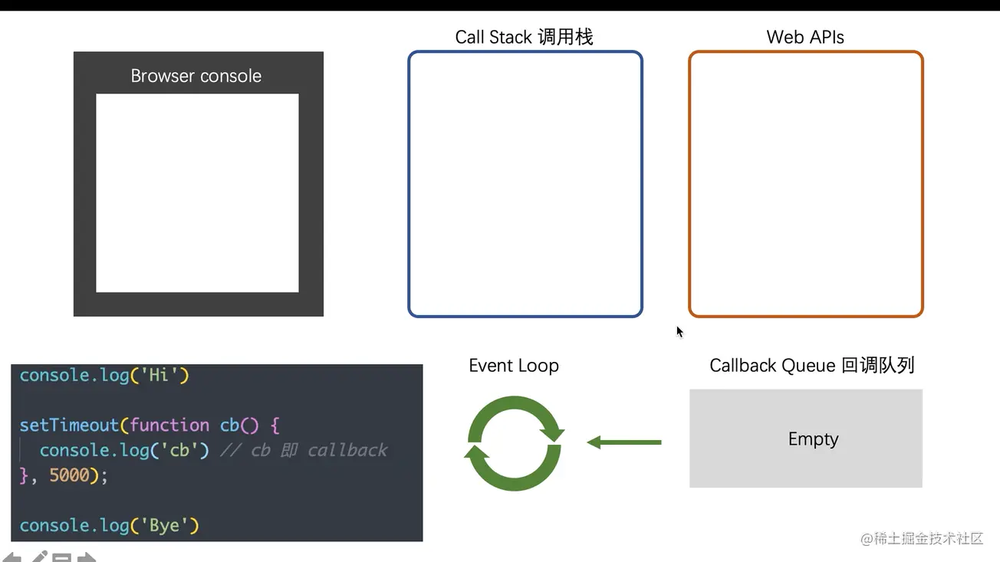

## 一、event loop、宏任务和微任务

首先推荐一个可以在线看代码流程的网站：[loupe](http://latentflip.com/loupe/?code=JC5vbignYnV0dG9uJywgJ2NsaWNrJywgZnVuY3Rpb24gb25DbGljaygpIHsKICAgIHNldFRpbWVvdXQoZnVuY3Rpb24gdGltZXIoKSB7CiAgICAgICAgY29uc29sZS5sb2coJ1lvdSBjbGlja2VkIHRoZSBidXR0b24hJyk7ICAgIAogICAgfSwgMjAwMCk7Cn0pOwoKY29uc29sZS5sb2coIkhpISIpOwoKc2V0VGltZW91dChmdW5jdGlvbiB0aW1lb3V0KCkgewogICAgY29uc29sZS5sb2coIkNsaWNrIHRoZSBidXR0b24hIik7Cn0sIDUwMDApOwoKY29uc29sZS5sb2coIldlbGNvbWUgdG8gbG91cGUuIik7!!!PGJ1dHRvbj5DbGljayBtZSE8L2J1dHRvbj4%3D)。 然后看下这个视频学习下：[到底什么是 Event Loop 呢？](https://www.bilibili.com/video/BV1oV411k7XY/?spm_id_from=333.788.recommend_more_video.-1)

简单的例子：

```js
console.log("Hi");

setTimeout(() => {
  console.log("cb");
}, 5000);

console.log("Bye");
```

它的执行过程是这样的：



Web APIs 会创建对应的线程，比如 setTimeout 会创建定时器线程，ajax 请求会创建 http 线程。。。这是由 js 的运行环境决定的，比如浏览器。

看完上面的视频之后，至少大家画 Event Loop 的图讲解不是啥问题了，但是涉及到宏任务和微任务，我们还得拜读一下这篇文章：[这一次，彻底弄懂 JavaScript 执行机制](https://juejin.cn/post/6844903512845860872)。如果意犹未尽，不如再读下这篇非常详细带有大量动图的文章：[做一些动图，学习一下 EventLoop](https://juejin.cn/post/6969028296893792286#comment)。想了解事件循环和页面渲染之间关系的又可以再阅读这篇文章：[深入解析你不知道的 EventLoop 和浏览器渲染、帧动画、空闲回调（动图演示）](https://juejin.cn/post/6844904165462769678)。

<storge>注意：1.Call Stack 调用栈空闲 -> 2.尝试 DOM 渲染 -> 触发 Event loop。</storge>

- 每次 Call Stack 清空（即每次轮询结束），即同步任务执行完。

- 都是 DOM 重新渲染的机会，DOM 结构有改变则重新渲染。

- 然后再去触发下一次 Event loop。

宏任务：setTimeout，setInterval，Ajax，DOM 事件。 微任务：Promise async/await。

两者区别：

- 宏任务：DOM 渲染后触发，如 setTimeout 、setInterval 、DOM 事件 、script 。

- 微任务：DOM 渲染前触发，如 Promise.then 、MutationObserver 、Node 环境下的 process.nextTick 。

从 event loop 解释，为何微任务执行更早？

- 微任务是 ES6 语法规定的（被压入 micro task queue）。

- 宏任务是由浏览器规定的（通过 Web APIs 压入 Callback queue）。

- 宏任务执行时间一般比较长。

- 每一次宏任务开始之前一定是伴随着一次 event loop 结束的，而微任务是在一次 event loop 结束前执行的。

## 二、Promise

关于这一块儿没什么好说的，最好是实现一遍 Promise A+ 规范，多少有点印象，当然面试官也不会叫你默写一个完整的出来，但是你起码要知道实现原理。

> 关于 Promise 的所有使用方式，可参照这篇文章：`ECMAScript 6 入门 - Promise 对象`。
> 手写 Promise 源码的解析文章，可阅读此篇文章：`从一道让我失眠的 Promise 面试题开始，深入分析 Promise 实现细节`。
> 关于 Promise 的面试题，可参考这篇文章：`要就来 45 道 Promise 面试题一次爽到底`。

手写 Promise

```js
class MyPromise {
  static pending = "pending";
  static fulfilled = "fulfilled";
  static rejected = "rejected";
  constructor(executor) {
    if (!this._isFunction(executor)) {
      throw new Error(`${executor} is not a function`);
    }
    this._status = MyPromise.pending;
    this._state = undefined;
    this._handleFulfilled = [];
    this._handleRejected = [];
    executor(this.resolve.bind(this), this.reject.bind(this));
  }
  _isFunction(val) {
    return Object.prototype.toString.call(val) === "[object Function]";
  }
  resolve(val) {
    if (this._status === MyPromise.pending) {
      this._status = MyPromise.fulfilled;
      this._state = val;
      let cb;
      // 异步按顺序调用并清空回调
      setTimeout(() => {
        while ((cb = this._handleFulfilled.shift())) {
          cb(val);
        }
      }, 0);
    }
  }
  reject(val) {
    if (this._status === MyPromise.pending) {
      this._status = MyPromise.rejected;
      this._state = val;
      let cb;
      // 异步按顺序调用并清空回调
      setTimeout(() => {
        while ((cb = this._handleRejected.shift())) {
          cb(val);
        }
      }, 0);
    }
  }
  then(onFulfilled, onRejected) {
    let self = this;
    const { _state, _status } = this;
    // 如果onFulfilled、onRejected不是函数，强制改为函数，并且该函数直接返回接收到的参数，传后面的then的回调函数
    onFulfilled = self._isFunction(onFulfilled) ? onFulfilled : (v) => v;
    onRejected = self._isFunction(onRejected) ? onRejected : (v) => v;
    return new MyPromise((resolve, reject) => {
      const fulfilled = (val) => {
        let res = onFulfilled(val);
        if (res instanceof MyPromise) {
          res.then(resolve, reject);
        } else {
          resolve(res);
        }
      };
      const rejected = (value) => {
        const res = onRejected(value);
        if (res instanceof MyPromise) {
          // 这里是重点
          res.then(resolve, reject);
        } else {
          // 注意这里是resolve(res)，而不是reject(res)
          resolve(res);
        }
      };
      switch (_status) {
        case MyPromise.pending:
          self._handleFulfilled.push(fulfilled);
          self._handleRejected.push(rejected);
          break;
        case MyPromise.fulfilled:
          resolve(_state);
          break;
        case MyPromise.rejected:
          rejected(_value);
          break;
        default:
          throw new Error("Promise resolver Unverified status");
      }
    });
  }
}

new MyPromise((resolve) => {
  console.log(1);
  setTimeout(() => {
    resolve(2);
  }, 3000);
}).then((res) => {
  console.log(res);
});
```

实现一个 Promise.all：

```js
Promise.all = function (promises) {
  return new Promise((resolve, reject) => {
    // 参数可以不是数组，但必须具有 Iterator 接口
    if (typeof promises[Symbol.iterator] !== "function") {
      reject("Type error");
    }
    if (promises.length === 0) {
      resolve([]);
    } else {
      const res = [];
      let count = 0;
      const len = promises.length;
      for (let i = 0; i < len; i++) {
        //考虑到 promises[i] 可能是 thenable 对象也可能是普通值
        Promise.resolve(promises[i])
          .then((data) => {
            res[i] = data;
            if (++count === len) {
              resolve(res);
            }
          })
          .catch((err) => {
            reject(err);
          });
      }
    }
  });
};
```

## 三、async/await 和 Promise 的关系

- async/await 是消灭异步回调的终极武器。

- 但和 Promise 并不互斥，反而，两者相辅相成。

- 执行 async 函数，返回的一定是 Promise 对象。

- await 相当于 Promise 的 then。

- try...catch 可捕获异常，代替了 Promise 的 catch。
